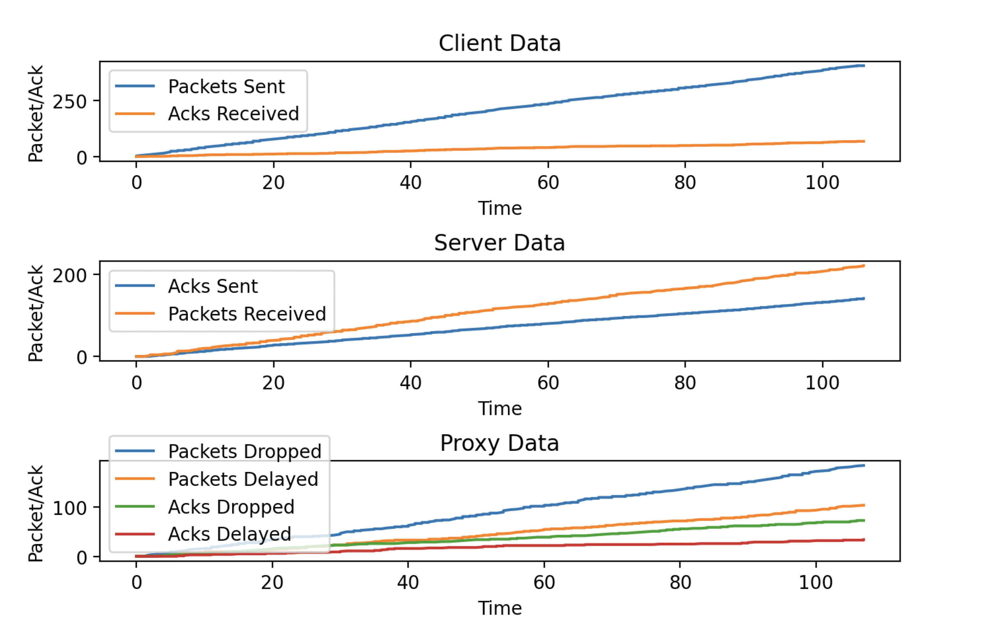

# Loss Network Simulator with Custom IP Protocol

## Overview
This project is a sophisticated network simulator that demonstrates the handling of packet loss, dynamic packet delay, and acknowledgement management in network communication. It's designed with a client-server architecture and includes a proxy for manipulating network conditions in real time. A GUI is also implemented for data transfer analysis. The entire project is implemented in Python and has functions that can only be run on UNIX environments.

## Features
- **Custom IP Protocol Handling:** Simulates both IPv4 and IPv6 protocols.
- **Dynamic Network Simulation:** Includes a proxy to simulate packet loss and delay based on real-time user input.
- **Real-Time Data Monitoring:** GUI for monitoring network conditions.
- **Extensive Logging and Output:** The Server, Proxy and GUI keeps a log of data that is being transferred.

## Components
1. **Client:** Sends data packets through the proxy.
2. **Server:** Receives packets, logs data, and sends acknowledgements.
3. **Proxy:** Dynamically adjusts packet and ack drop rates and delays.
4. **GUI:** Provides a user interface for real-time network condition manipulation.

## Getting Started
### Prerequisites
- Python 3.x
- Any modern operating system (Windows, macOS, Linux)

### Installation
Clone the repository:
<br/>
```
git clone https://github.com/mark-p7/AdvancedLossyNetworkSimulator.git
```

### Running the Application
Order of execution is crucial for proper operation:
1. **Start the GUI:**

```
python3 gui.py [IP] [Port1] [Port2] [Port3]
```

2. **Start the Proxy:**

```
python3 proxy.py [Proxy IP] [Proxy Port] [Server Port] [Server IP] [GUI Port]
```

3. **Start the Server:**

```
python3 server.py [Server IP] [Server Port] [GUI Port]
```

4. **Start the Client:**

```
python3 client.py [Client IP] [Client Port] [Proxy Port] [GUI Port]
```

### Example Run (IPv6)

```
python3 client.py 2001:569:52a5:5e00:1137:2b4e:1a50:9b7 8888 2001:569:52a5:5e00:1137:2b4e:1a50:9b7 8889 2001:569:52a5:5e00:1137:2b4e:1a50:9b7 7771
python3 server.py 2001:569:52a5:5e00:1137:2b4e:1a50:9b7 8080 2001:569:52a5:5e00:1137:2b4e:1a50:9b7 7772
python3 proxy.py 2001:569:52a5:5e00:1137:2b4e:1a50:9b7 8889 7651 2001:569:52a5:5e00:1137:2b4e:1a50:9b7 8080 2001:569:52a5:5e00:1137:2b4e:1a50:9b7 7773
python3 gui.py 2001:569:52a5:5e00:1137:2b4e:1a50:9b7 7771 7772 7773
```

### Example Run (IPv4)


```
python3 client.py 192.168.1.101 8888 192.168.1.101 8889 192.168.1.101 7771
python3 server.py 192.168.1.101 8080 192.168.1.101 7772
python3 proxy.py 192.168.1.101 8889 7651 192.168.1.101 8080 192.168.1.101 7773
python3 gui.py 192.168.1.101 7771 7772 7773
```

### Example Run (IPv6) with file stdin and stdout

```
python3 client.py 2001:569:52a5:5e00:1137:2b4e:1a50:9b7 8888 2001:569:52a5:5e00:1137:2b4e:1a50:9b7 8889 2001:569:52a5:5e00:1137:2b4e:1a50:9b7 7771 < input3.txt
python3 server.py 2001:569:52a5:5e00:1137:2b4e:1a50:9b7 8080 2001:569:52a5:5e00:1137:2b4e:1a50:9b7 7772 > output.txt
python3 proxy.py 2001:569:52a5:5e00:1137:2b4e:1a50:9b7 8889 7651 2001:569:52a5:5e00:1137:2b4e:1a50:9b7 8080 2001:569:52a5:5e00:1137:2b4e:1a50:9b7 7773
python3 gui.py 2001:569:52a5:5e00:1137:2b4e:1a50:9b7 7771 7772 7773
```

### Example Run (IPv4) with file stdin and stdout

```
python3 client.py 192.168.1.101 8888 192.168.1.101 8889 192.168.1.101 7771 < input3.txt
python3 server.py 192.168.1.101 8080 192.168.1.101 7772 > output.txt
python3 proxy.py 192.168.1.101 8889 7651 192.168.1.101 8080 192.168.1.101 7773
python3 gui.py 192.168.1.101 7771 7772 7773
```

### Shutdown Procedure
To properly close the application, follow this order:

1. Close the GUI.
2. Terminate the Client.
3. Shutdown the Proxy.

### Sample GUI Screenshots

#### 50% Chance to drop/delay all packets and acks
